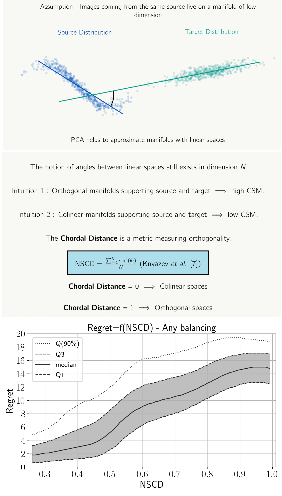

# Official repository for the paper :

## "Leveraging Data Geometry to Mitigate CSM in Steganalysis"

### released at @[WIFS2023](https://wifs2023.fau.de/) (Nuremberg, Germany)

  

[](#CitingUs)   [](https://hal.science/hal-04229257v1/)  [](https://bit.ly/wifs2022holisticsteganalysis)

<p align="center">
  
</p>


### Rony Abecidan, Vincent Itier, Jeremie Boulanger, Patrick Bas, Tomáš Pevný


<br/>

*Abstract : In operational scenarios, steganographers use sets of covers from various sensors and processing pipelines that differ significantly from those used by researchers to train steganalysis models. This leads to an inevitable performance gap when dealing with out-of-distribution covers, commonly referred to as Cover Source Mismatch (CSM). In this study, we consider the scenario where test images are processed using the same pipeline. However, knowledge regarding both the labels and the balance between cover and stego is missing. Our objective is to identify a training dataset that allows for maximum generalization to our target. By exploring a grid of processing pipelines fostering CSM, we discovered a geometrical metric based on the chordal distance between subspaces spanned by DCTr features, that exhibits high correlation with operational regret while being not affected by the cover-stego balance. Our contribution lies in the development of a strategy that enables the selection or derivation of customized training datasets, enhancing the overall generalization performance for a given target. Experimental validation highlights that our geometry-based optimization strategy outperforms traditional atomistic methods given reasonable assumptions.*

## Comments about the repo : 

- The file ```pipelines.csv``` is a directory of pipelines disclosing their parameters and identifying them precisely with a number.

- To be able to reproduce our results, you need classical python library (e.g. numpy, matplotlib and pandas). A playground notebook is available to let you reproduce the results using these library.


## Main references

```BibTeX
@article{giboulot:hal-02631559,
  TITLE = {{Effects and Solutions of Cover-Source Mismatch in Image Steganalysis}},
  AUTHOR = {Giboulot, Quentin and Cogranne, R{\'e}mi and Borghys, Dirk and Bas, Patrick},
  URL = {https://hal-utt.archives-ouvertes.fr/hal-02631559},
  JOURNAL = {{Signal Processing: Image Communication}},
  PUBLISHER = {{Elsevier}},
  SERIES = {86},
  YEAR = {2020},
  MONTH = Aug,
  DOI = {10.1016/j.image.2020.115888},
  KEYWORDS = {Steganography ; Steganalysis ; Cover-Source Mismatch ; Image processing ; Image Heterogeneity},
  PDF = {https://hal-utt.archives-ouvertes.fr/hal-02631559/file/ImageCommunication_Final.pdf},
  HAL_ID = {hal-02631559},
  HAL_VERSION = {v1},
}

@inproceedings{cogranne:hal-02147763,
  TITLE = {{The ALASKA Steganalysis Challenge: A First Step Towards Steganalysis ''Into The Wild''}},
  AUTHOR = {Cogranne, R{\'e}mi and Giboulot, Quentin and Bas, Patrick},
  URL = {https://hal.archives-ouvertes.fr/hal-02147763},
  BOOKTITLE = {{ACM IH\&MMSec (Information Hiding \& Multimedia Security)}},
  ADDRESS = {Paris, France},
  SERIES = {ACM IH\&MMSec (Information Hiding \& Multimedia Security)},
  YEAR = {2019},
  MONTH = Jul,
  DOI = {10.1145/3335203.3335726},
  KEYWORDS = {steganography ; steganalysis ; contest ; forensics ; Security and privacy},
  PDF = {https://hal.archives-ouvertes.fr/hal-02147763/file/ALASKA_lesson_learn_Vsubmitted.pdf},
  HAL_ID = {hal-02147763},
  HAL_VERSION = {v1},
}

@inproceedings{sepak,
	title = {Formalizing cover-source mismatch as a robust optimization},
	author = {Šepák, Dominik and Adam, Lukáš and Pevný, Tomáš},
  BOOKTITLE  = {{EUSIPCO: European Signal Processing Conference}},
  MONTH = Sep,
  ADDRESS = {Belgrade, Serbia},
  YEAR = {2022},
}


@article{article,
	author = {Knyazev, Andrew and Argentati, Merico},
	doi = {10.1137/S1064827500377332},
	journal = {Industrial and Applied Mathematics},
	month = {01},
	pages = {2009-2041},
	title = {Principal Angles between Subspaces in an A -Based Scalar Product: Algorithms and Perturbation Estimates},
	volume = {23},
	year = {2002},
	Bdsk-Url-1 = {https://doi.org/10.1137/S1064827500377332}}


@article{article,
	author = {Kodovsky, Jan and Sedighi, Vahid and Fridrich, Jessica},
	doi = {10.1117/12.2039693},
	month = {01},
	title = {Study of Cover Source Mismatch in Steganalysis and Ways to Mitigate its Impact},
	volume = {9028},
	year = {2014},
	Bdsk-Url-1 = {https://doi.org/10.1117/12.2039693}}


```

---
<a name="CitingUs"></a>
## Citing our paper
### If you wish to refer to our paper,  please use the following BibTeX entry
```BibTeX

@inproceedings{abecidan:hal-04229257,
  TITLE = {{Leveraging Data Geometry to Mitigate CSM in Steganalysis}},
  AUTHOR = {Abecidan, Rony and Itier, Vincent and Boulanger, J{\'e}r{\'e}mie and Bas, Patrick and Pevn{\'y}, Tom{\'a}{\v s}},
  URL = {https://hal.science/hal-04229257},
  BOOKTITLE = {{IEEE International Workshop on Information Forensics and Security (WIFS 2023)}},
  ADDRESS = {Nuremberg, Germany},
  YEAR = {2023},
  MONTH = Dec,
  KEYWORDS = {steganalysis ; steganography ; forensics ; cover source mismatch ; domain generalization ; machine learning ; domain adaptation ; data adaptation},
  PDF = {https://hal.science/hal-04229257/file/2023_wifs.pdf},
  HAL_ID = {hal-04229257},
  HAL_VERSION = {v1},
}

```
## Acknowledgements

Our experiments were possible thanks to computing means of IDRIS through the resource allocation 2022-AD011013285R1 assigned by GENCI. This work received funding from the European Union’s Horizon 2020 research and innovation program under grant agreement No 101021687 (project “UNCOVER”) and the French Defense & Innovation Agency. The work of Tomas Pevny was supported by Czech Ministry of Education 19-29680L.
